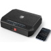

# Supported devices

|  | Device | Support status | Tested version |
| - | - | - | - |
|  | HomeBase (T8001) | :heavy_check_mark: |  |
|  | HomeBase E (T8002) | :heavy_check_mark: :heavy_exclamation_mark: |  |
|  | HomeBase 2 (T8010) | :heavy_check_mark: |  |
|  | HomeBase 3 (T8030, S380) | :wrench: | Firmware: 3.1.0.8 (20221101) |
|  | Smart Lock Wi-Fi Bridge (T8021) | :heavy_check_mark: :wrench: |  |
|  | eufyCam (T8111) | :heavy_check_mark: |  |
|  | eufyCam E (T8112) | :heavy_check_mark: |  |
|  | eufyCam 2 (T8114) | :heavy_check_mark: | Firmware: 2.7.4 |
|  | eufyCam 2C (T8113) | :heavy_check_mark: |  |
|  | eufyCam 2 Pro (T8140) | :heavy_check_mark: |  |
|  | eufyCam 2C Pro (T8141) | :heavy_check_mark: |  |
|  | eufyCam 3 (T8160, S330) | :heavy_check_mark: | Firmware: 3.1.8.6 (20221101) |
|  | eufyCam 3C (T8161, S300) | :heavy_check_mark: | Firmware: 3.1.8.6 (20221101) |
|  | SoloCam E20 (T8130) | :heavy_check_mark: |  |
|  | SoloCam E40 (T8131) | :heavy_check_mark: |  |
|  | SoloCam L20 (T8122) | :heavy_check_mark: | Firmware: 1.0.8.1 |
|  | SoloCam L40 (T8123) | :heavy_check_mark: |  |
|  | SoloCam S40 (T8124) | :heavy_check_mark: |  |
|  | SoloCam S220 (T8134) | :heavy_check_mark: |  |
|  | Floodlight Camera (T8420) | :heavy_check_mark: | Firmware: 1.0.0.35 Hardware: 2.2 (20211219) |
|  | Floodlight Camera (T8420X) | :heavy_check_mark: | Firmware: 2.0.6.1 (20220824) |
|  | Floodlight Cam (T8422) | :heavy_check_mark: |  |
|  | Floodlight Cam 2 Pro (T8423) | :heavy_check_mark: | Firmware: 1.0.7.4 (20211219) |
|  | Floodlight Cam 2 (T8424) | :heavy_check_mark: | Firmware: 2.0.8.8 (20230807) |
|  | Wired Wall Light Cam S100 (T84A1) | :heavy_check_mark: | Firmware: 1.0.8.2 (20230521) |
|  | Wired Doorbell 2k (T8200) | :heavy_check_mark: |  |
|  | Wired Doorbell 2k (T8200X) | :heavy_check_mark: | Firmware: 2.0.6.0 (20220826) |
|  | Wired Doorbell 1080p (T8201) | :heavy_check_mark: |  |
|  | Video Doorbell Dual (T8203) | :heavy_check_mark: | Firmware: 2.0.4.6 (20220417) |
|  | Battery Doorbell 2K (T8210) | :heavy_check_mark: |  |
|  | Battery Doorbell 2K Dual (T8213) | :heavy_check_mark: | Firmware: 0.1.2.5 (20220331) |
|  | Battery Doorbell 1080p (T8222) | :heavy_check_mark: |  |
|  | Entry Sensor (T8900) | :heavy_check_mark: |  |
|  | Motion sensor (T8910) | :heavy_check_mark: |  |
|  | Indoor Cam Pan&Tilt 2K (T8410) | :heavy_check_mark: | Firmware: 2.1.0.6 |
|  | Indoor Cam 2K (T8400) | :heavy_check_mark: |  |
|  | Indoor Cam Pan&Tilt 1080p (T8411) |:heavy_check_mark:  |  |
|  | Indoor Cam 1080p (T8401) | :heavy_check_mark: |  |
|  | Indoor Cam Mini (T8414) | :heavy_check_mark: | Firmware: 3.1.1.7 (20220427) |
|  | 4G LTE Starlight (T8150) | :heavy_check_mark: |  |
|  | 4G LTE Starlight (T8151) | :heavy_exclamation_mark: |  |
|  | 4G LTE Starlight (T8152) | :heavy_exclamation_mark: |  |
|  | 4G LTE Starlight (T8153) | :heavy_exclamation_mark: |  |
|  | Smart Lock (T8500) | :x: |  |
|  | Smart Lock (T8500) with Wi-Fi Bridge | :heavy_check_mark: :wrench: |  |
|  | Smart Lock Touch (T8510) | :x: |  |
|  | Smart Lock Touch (T8510) with Wi-Fi Bridge | :heavy_check_mark: :wrench: |  |
|  | Smart Lock Touch & Wifi (T8520) | :heavy_check_mark: :wrench: | Firmware: 1.3.6.8 (20220205), 1.3.8.0 (20220816) |
|  | Keypad (T8960) | :heavy_check_mark: |  |
|  | Smart Safe S10 (T7400) | :heavy_check_mark: | Firmware: 1.0.3.4 (20221029) |
|  | Smart Safe S12 (T7401) | :heavy_exclamation_mark: |  |
|  | SmartDrop (T8790) |  |  |
|  | Garage-Control Cam (T8452) | :heavy_check_mark: | Firmware: 1.2.3.1 (20230521) |

## Legend

| Icon | Description |
| - | - |
| :x: | Not supported |
| :heavy_check_mark: | Supported |
| :wrench: | Basic functionality |
| :heavy_exclamation_mark: | Untested |
